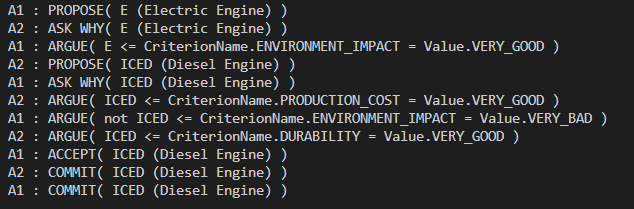
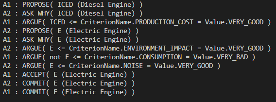

# Argumentation-based-Dialogue

## Déroulé du dialogue
- chaque agent check sa boîte mail pour chaque performative 
- si aucun message n’a été reçu, alors l’agent PROPOSE son item préféré
- dès qu’un agent reçoit un PROPOSE, il répond par un ASK WHY
- lorsqu’un agent reçoit  un ASK WHY, il répond en donnant le critère qu’il préfère et qui a la plus grande Value 
- immédiatement après la première argumentation, l’agent en face va proposer son items préféré
- ce PROPOSE va donc être suivie d’un ASK WHY, puis une première argumentation en faveur, comme pour le premier objet
- se déroule ensuite l’argumentation entre les deux agents, qui vont commencer par ARGUE sur le dernier objet proposé (c'est-à-dire le deuxième)
- lorsqu’un agent arrive à court d’arguments, l’objet est accepté (ACCEPT)
- lorsqu'un des deux agents reçoit un ACCEPT, il envoie un COMMIT 
- lorsqu'un des deux agents reçoit un COMMIT, il COMMIT également

## Choix d'implémentation

Nous avons implémenté une fonction *get_new_message_from_performative()* dans Mailbox.py pour récupérer les nouveaux messages pour chaque performative, ce qui permet d'alléger légèrement le code.

Nous avons suivi les recommandations du sujet pour ce qui est de l'implémentation de la classe Préférence et de ses méthodes.

La génération des préférences d'un agent est faite à partir de la lecture d'un csv. (cf *Pref_agent1.csv* et *Pref_agent2.csv*).

Le déroulement de l'argumentation a posé quelques problèmes: nous avons eu du mal à intégrer l’objet *Argument* dans notre code. Nous avons plutôt eu recours à des méthodes propres aux agents ainsi qu'à des listes.
Nous avons cependant eu recours aux méthodes *List_supporting_proposal* et *List_attacking_proposal*.

## Implémentation de l'argumentation
Nous définissons un argument comme un tuple (item, critère, valeur). A chaque fois qu'un argument est émis, il est stocké dans la liste *argument_list*. 

Dans notre code, un argument est identifié comme étant PRO ou CON un objet à l'aide du message qui l'entoure. Si un agent reçoit un message "not E <= ...", il détectera le "not" et saura que c'est un argument CON E.

L'agent va adopter une position jusqu'à ce que quelqu'un arrive à court d'arguments. 

### Posture PRO
Dans le cas où un agent adopte la posture PRO, il va avoir recours à la méthode *support_proposal*. Cette méthode va elle-même appeler la méthode *List_supporting_proposal* pour obtenir tous les arguments en faveur d'un objet, dans l'ordre de préférence. Elle retourne l'argument le plus haut dans l'ordre de préférence qui n'a pas encore été utilisé par l'agent. Elle renvoie un argument sous la forme de chaîne de caractère "(conclusion <= premise)".

### Posture CON
Dans le cas où un agent adopte la posture CON, il va avoir recours à la méthode *find_attacking_arg*. Cette méthode prend en argument un item et va essayer de trouver des arguments contre. Elle va faire défiler tous les arguments PRO et utilise la méthode *can_be_attacked* pour vérifier si ces arguments peuvent être attaqués (et pour vérifier si les arguments attaquants n'ont pas déjà été utilisés).

Tel que nous l'avons codé, un argument peut être attaqué si il existe pour l'agent CON un critère plus important dans son ordre de préférence possédant une valeur basse (BAD ou VERY BAD). 

Il existe cependant d'autres manières dont un argument peut être attaqué, comme listées dans la question 9 du sujet. Nous avons cependant manqué de temps pour implémenter ces règles là.

### Changement de posture 
Nous voulions à terme implémenter un changement de posture. Lorsqu'un agent arrive à cours d'arguments PRO/CON un objet, il switch vers une argumentation CON/PRO de l'autre objet. Nous n'avons pas eu le temps de l'implémenter.

## Fin du dialogue
Nous avons commencé par une approche "naïve" pour la fin du dialogue : le premier agent à arriver à cours d'arguments CON doit accepter l'objet qu'il attaquait. 
Dans la pratique, comme notre implémentation de *can_be_attacked* est très stricte (i.e il y a très peu de cas où un argument peut être attaqué), les agents arrivent vite à cours d'arguments CON, et c'est donc l'agent qui a proposé en deuxième qui gagne (une technique à retenir dans la vie de tous les jours?).

Dans l'idéal, nous aurions voulu implémenter à terme un vrai échange entre les deux agents, où chacun donne les arguments pour ou contre chaque objet jusqu'à épuisement des arguments, puis accepte l'objet qui à le plus d'arguments pour (par exemple). 

## Le dialogue 
Le dialogue lorsque le moteur électrique est proposé en premier. Le Diesel est accepté.

Le dialogue lorsque le moteur diesel est proposé en premier. Le moteur électrique est accepté.

